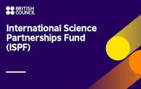
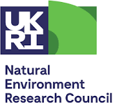
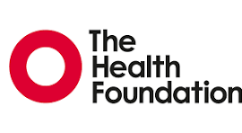

My research draws on applied microeconomics and behavioural economics, with applications in public health, food choices, and consumer behaviour. I focus on understanding how individuals form preferences, perceive risk, and make decisions across consumption, health, financial, and policy contexts — and on applying and advancing the stated preference methods needed to measure these processes rigorously (including work on preference heterogeneity, attribute non-attendance, decision heuristics, position bias, and experimental design).

A thread running through this work is methodological. I apply and advance discrete choice experiments, best-worst scaling, and survey design to uncover values and priorities that cannot easily be observed directly — with as much attention to whether the tools are asking the right questions as to the answers they produce.

```{=html}
<div class="tags">
  <span class="tag">Applied Microeconomics</span>
  <span class="tag">Behavioural Economics</span>
  <span class="tag">Discrete Choice Experiments</span>
  <span class="tag">Best-Worst Scaling</span>
  <span class="tag">Consumer Preferences</span>
  <span class="tag">Risk Perception</span>
  <span class="tag">Food Choices</span>
  <span class="tag">Health Economics</span>
  <span class="tag">Financial Decision-Making</span>
  <span class="tag">Survey & Experimental Design</span>
</div>
```

## Research Areas

```{=html}
<div class="area"><p><strong>Consumer choice and food</strong> — How do labelling, framing, and information provision shape food purchasing decisions? I examine how consumers respond to nutritional labels, packaging claims, and new food technologies — and what this reveals about the gap between stated preferences and actual behaviour.</p></div>

<div class="area"><p><strong>Health economics and patient preferences</strong> — What do patients and the public genuinely value in health services and self-management? How should those preferences inform policy, investment, and clinical decision-making?</p></div>

<div class="area"><p><strong>Nudging, information, and behaviour change</strong> — How does the framing and presentation of information influence decisions? I examine nudge interventions, labelling strategies, and communication tools — asking when information changes behaviour and when it does not.</p></div>

<div class="area"><p><strong>Risk perception and understanding</strong> — How do individuals perceive, characterise, and make sense of risk? I examine how people understand risks across food, health, and clinical contexts — including food safety risk, maternity care decision-making, and the factors that shape whether risk information is trusted, processed, or acted upon.</p></div>

<div class="area"><p><strong>Financial decision-making</strong> — How do individuals form time preferences, make credit and repayment decisions, and navigate financial risk? What does behavioural economics reveal about financial choices that standard models miss?</p></div>

<div class="area"><p><strong>Stated preference methods</strong> — How can discrete choice experiments and best-worst scaling be designed, estimated, and interpreted more reliably, drawing on tools from behavioural science? How do we account for heterogeneity, heuristics, and bias in stated preference data?</p></div>
```

## Research Funding

```{=html}
<div class="project-list">

  <div class="project">
    <div class="project-logo">
      
      <span class="project-logo-text" style="display:none">British Council International Science Partnership Fund (ISPF)</span>
    </div>
    <div class="project-body">
      <p class="project-title">Community-Driven Nature-Based Solutions for Environmental Sustainability in Malaysian Aquaculture</p>
      <p class="project-meta">British Council ISPF &nbsp;·&nbsp; 2025–2026 <span class="role">Principal Investigator</span></p>
      <p class="project-desc">Working with aquaculture communities in Malaysia to co-develop nature-based solutions that improve environmental sustainability in fish farming systems, integrating community knowledge with scientific approaches to deliver locally relevant outcomes.</p>
    </div>
  </div>

  <div class="project">
    <div class="project-logo">
      
      <span class="project-logo-text" style="display:none">British Council</span>
    </div>
    <div class="project-body">
      <p class="project-title">Steering Innovation to Sustain Tilapia Production in Thailand</p>
      <p class="project-meta">British Council &nbsp;·&nbsp; 2024–2026 <span class="role">Co-Investigator</span></p>
      <p class="project-desc">Examining consumer and producer perspectives on tilapia production systems in Thailand, generating evidence to guide sustainable innovation and inform market development strategies for the sector.</p>
    </div>
  </div>

  <div class="project">
    <div class="project-logo">
      
      <span class="project-logo-text" style="display:none">NERC</span>
    </div>
    <div class="project-body">
      <p class="project-title">Engaging with One Health: Translating Perception around Aquatic and Terrestrial Animal Consumption in Vietnam and China</p>
      <p class="project-meta">NERC Discipline Hopping &nbsp;·&nbsp; 2022–2023 <span class="role">Co-Investigator</span></p>
      <p class="project-desc">Exploring how consumers in Vietnam and China perceive and value aquatic and terrestrial animal products through a One Health lens, bridging natural and social science approaches to understand consumption behaviour and sustainability trade-offs.</p>
    </div>
  </div>

  <div class="project">
    <div class="project-logo">
      
      <span class="project-logo-text" style="display:none">EPSRC</span>
    </div>
    <div class="project-body">
      <p class="project-title">The Wearable Clinic: Connecting Health, Self and Care</p>
      <p class="project-meta">EPSRC &nbsp;·&nbsp; 2018–2021 <span class="role">Work Package Leader</span></p>
      <p class="project-desc">Investigating patient and public preferences for wearable health technologies in the context of chronic disease self-management, examining how digital tools can better connect individuals with their care.</p>
    </div>
  </div>

   <div class="project">
    <div class="project-logo">
      
      <span class="project-logo-text" style="display:none">Health Foundation</span>
    </div>
    <div class="project-body">
      <p class="project-title">Patient Preferences for Self-Management Strategies Using Discrete Choice Experiment</p>
      <p class="project-meta">Health Foundation &nbsp;·&nbsp; 2014 <span class="role">Co-Investigator</span></p>
      <p class="project-desc">Using discrete choice experiments to elicit patient preferences for self-management strategies in chronic disease, providing evidence to support the design of patient-centred support programmes and inform health service policy.</p>
    </div>
  </div>

</div>
```
